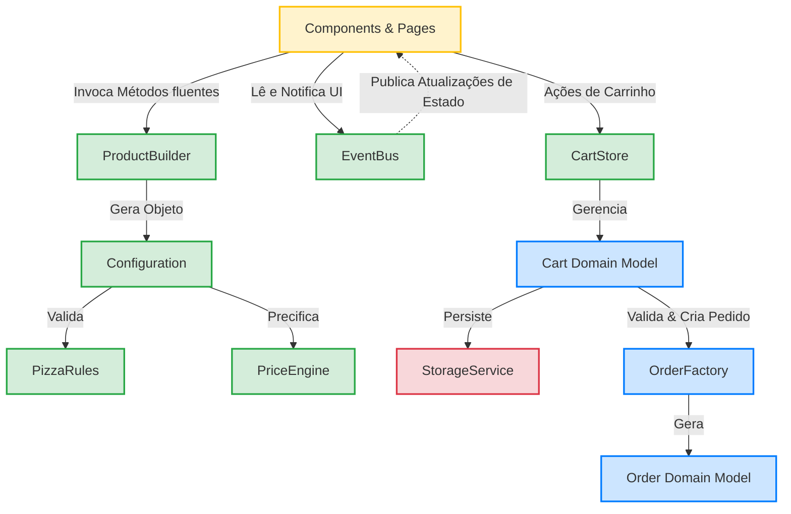

# Arquitetura de Software — PizzaFlow

O **PizzaFlow** utiliza uma arquitetura inspirada em conceitos consolidados de engenharia de software, priorizando a **Separação de Preocupações (Separation of Concerns - SoC)**, **Domain-Driven Design (DDD)** e uma **Arquitetura Orientada a Eventos (Event-Driven Architecture - EDA)** de forma puramente nativa, sem dependências de frameworks de interface (como React, Vue ou Angular).

Este documento detalha as decisões de design arquitetural, a divisão de camadas, responsabilidades específicas e os fluxos de comunicação do sistema.

---

## 🧭 Visão Geral da Arquitetura

O sistema é construído sobre uma infraestrutura mobile-first de página única (SPA - Single Page Application) e PWA. A comunicação entre a interface de usuário (DOM) e os motores de lógica ocorre de forma desacoplada através do barramento centralizado `EventBus`.

---

## 📦 Detalhamento das Camadas e Responsabilidades

### 🌐 1. Camada Frontend (Visão Geral da SPA)
O PizzaFlow roda como uma aplicação de página única (SPA). O carregamento inicial baixa os assets fundamentais (HTML, CSS e JavaScript estrutural), e todas as trocas de exibição subsequentes ocorrem dinamicamente manipulando a árvore do DOM sem requisições de recarregamento completo da página.

---

### ⚙️ 2. Camada Core (`src/core/`)
O **Core** representa o cérebro das regras de negócio do PizzaFlow. Ele é composto por serviços globais estruturados que não possuem qualquer acoplamento com a interface do usuário (HTML/DOM).

* **`EventBus.js`**: Canal de comunicação assíncrona. Utiliza o padrão *Publish/Subscribe* para propagar alterações de estado por toda a aplicação de forma desacoplada. Os componentes se inscrevem nos canais de interesse e reagem às publicações.
* **`ProductBuilder.js`**: Implementa o padrão *Builder*. Fornece uma interface de encadeamento fluente para construir configurações complexas de pizza (ex: selecionar sabores divididos, tamanhos e bordas) de forma incremental antes da adição final ao carrinho.
* **`PizzaRules.js`**: Concentra as restrições estritas do cardápio de pizzas da pizzaria, como limites de sabores por tamanho e incompatibilidades de adicionais/bordas.
* **`PriceEngine.js`**: Motor financeiro puro. Calcula o preço final de pizzas montadas com base em suas frações e tamanho, implementando regras como a cobrança pelo preço da fração de maior valor.
* **`CartStore.js`**: Singleton wrapper que faz a mediação de estado mutável entre os componentes visuais do carrinho e o domínio rico de carrinho (`domain/cart`).
* **`AppStore.js`**: Gerencia estados de sistema gerais (como a categoria de cardápio selecionada, query de busca ativa, endereço de entrega selecionado e status de carregamento).

---

### 🎨 3. Camada de Apresentação e Componentes (`src/js/components/` & `src/js/pages/`)
Responsável única e exclusivamente por renderizar elementos visuais, formatar dados para exibição do usuário e capturar interações do mouse, toque e teclado.

* **Components (`src/js/components/`)**: Elementos visuais modulares e encapsulados (como `Header`, `SearchBar`, `ProductCard`, `Toast`). Cada componente é governado por uma função fábrica que exporta as funções de ciclo de vida `build()` e `destroy()`.
* **Pages (`src/js/pages/`)**: Contêineres de tela completos carregados pelo roteador (como `HomePage`, `ProductPage`, `CartPage` e `OrderPage`). As páginas instanciam e coordenam os subcomponentes necessários para montar a tela final.

---

### 🧭 4. Camada Router (`src/js/router/`)
Gerencia o estado de navegação da SPA baseado no fragmento de Hash da URL (`window.location.hash`).

* **`router.js`**: Intercepta a mudança na URL (evento `hashchange`), limpa os componentes da página anterior invocando seus respectivos métodos `destroy()`, e instancia a nova página de destino acoplando-a ao contêiner HTML principal.

---

### 🛠️ 5. Camada Services (`src/js/services/`)
Abstrai a comunicação com recursos e tecnologias de infraestrutura externa e do navegador.

* **`api.js`**: Gerencia a comunicação HTTP via `fetch` para busca do cardápio, produtos e envio do pedido consolidado. Implementa um fallback transparente para dados locais mockados (`mockData.js`) se a variável de ambiente `VITE_API_URL` não for configurada.
* **`StorageService.js`**: Wrapper de acesso ao `localStorage` do navegador para persistência duradoura das sessões de compra.
* **`pwa.js`**: Gerencia o ciclo de vida do Service Worker, escuta eventos de instalação offline e notificações de atualizações do app.

---

### 💾 6. Camada Store Legada (`src/js/store/`)
* **`store.js` & `ProductBuilderStore.js`**: Classes de controle baseadas no padrão Observer que mantêm os estados gerais da interface do usuário que ainda não foram totalmente migrados para modelos ricos sob a camada de `domain/`.

---

### 📐 7. Camadas Auxiliares (`src/js/utils/` & `src/js/data/`)
* **`utils/`**: Contém funções utilitárias auxiliares de formatação de strings, formatação financeira (`formatters.js`) e manipuladores rápidos do DOM, debounce e manipulação de arrays (`helpers.js`).
* **`data/`**: Guarda a base estática de dados mockados em `mockData.js` para desenvolvimento offline e demonstração rápida das capacidades do sistema.
